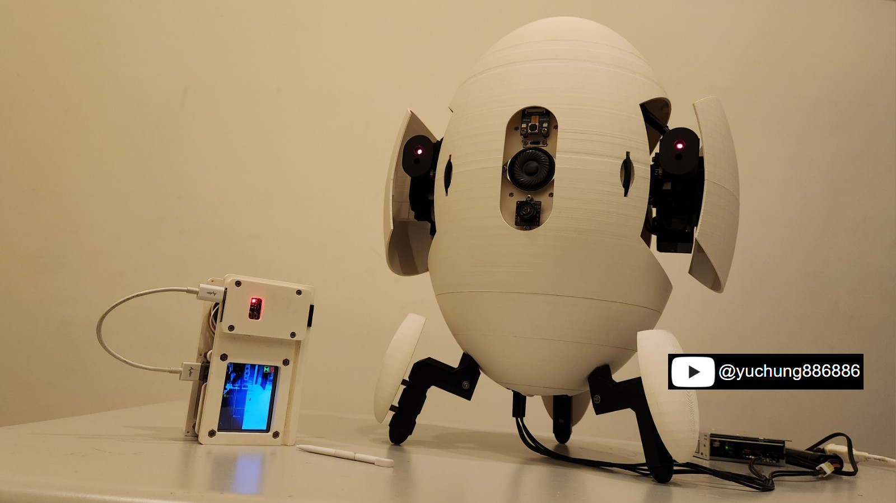

# Portal inspired sentry turret
  
The Portal inspired sentry turret project is a pair of AEGs with a camera module that can be remote-controlled by a touch panel. This repository provides the firmware source code and the hardware schematic of the project. 

# Features demostration
TBD

# Hardware components
The schematic of the sentry project is in the hardware/ folder of this repository. All electronic units placed in the schematic are off-the-shelf modules that  can be found and purchased on the web. You can refer to the part numbers of these modules listed in the Chapter 1.

# Firmware development environment setup
Two firmware source code packages, the Controller and the Turret, are in the firmware/ folder. These codes are developed based on Espressif ESP32-S3 MCU. ESP-IDF development framework v5.0.1 is required to configure the settings, build the firmware source code, and flash the firmware binary of these source packages. Please refer to the Chapter 2 for the detail tutorial.

# Mechanical compopnents
All the STL files of the 3D printed parts are sold on Cult3D. Besides the 3D printed parts, there are also some off-the-shelf mechanical components used in this project and you can refer to the part names listed in the Chapter 1 to search and purchase these parts on the web.

# Tutorial
Please refer to the playlist for the assembly guide of this project.
